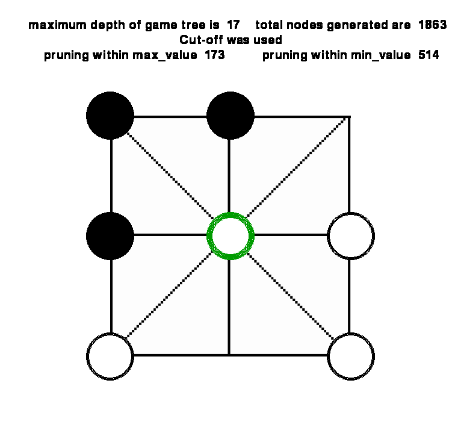
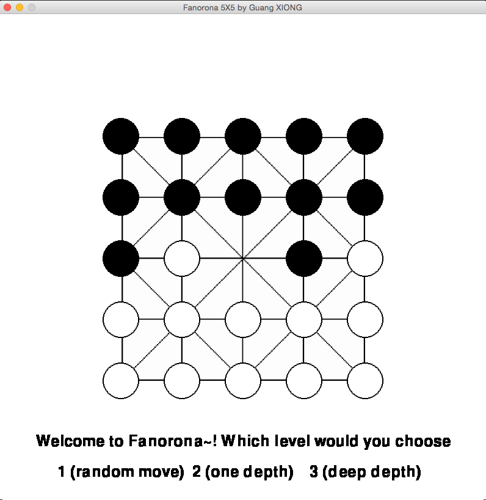
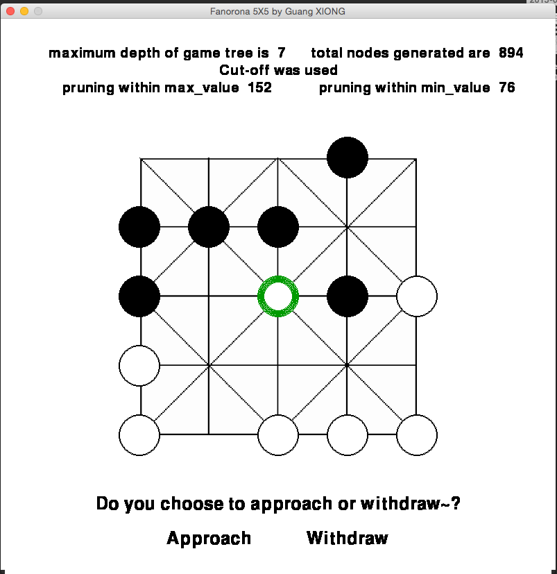
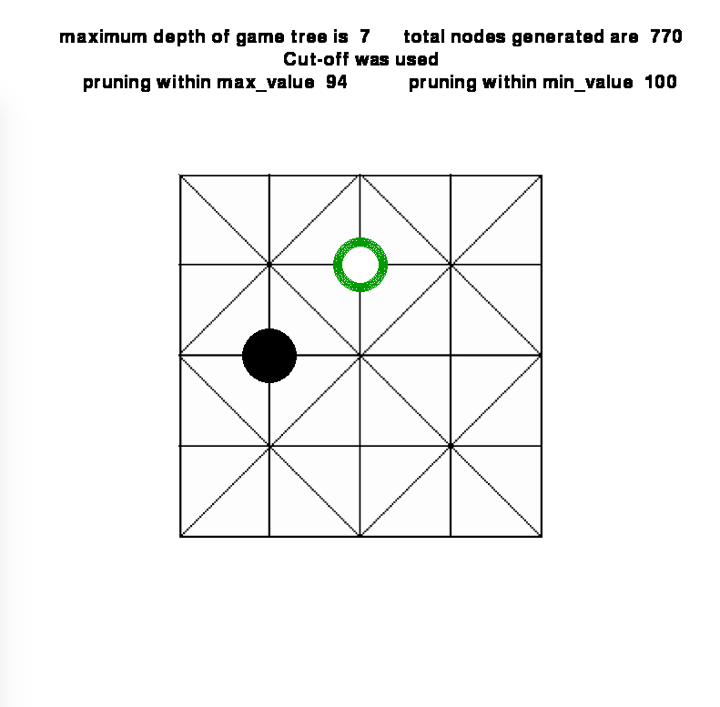
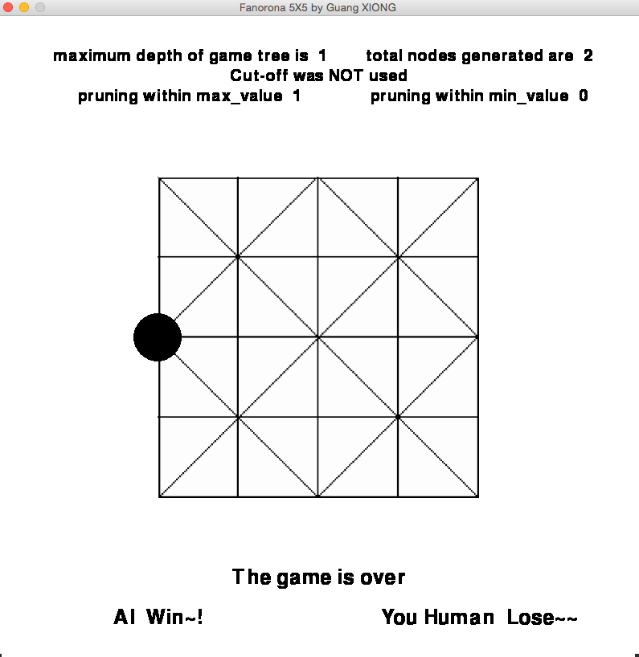

# Fanorona-Game-AI

## Snapshots
|
 

 

 
Python GUI implementation of board game [Fanorona](http://en.wikipedia.org/wiki/Fanorona) between human and AI using [Alpha-Beta-Search](http://en.wikipedia.org/wiki/Alpha%E2%80%93beta_pruning) and [Heuristics Evaluation Function](http://en.wikipedia.org/wiki/Heuristic_%28computer_science%29). 
 
## Design Strategies Used: 
1. Cutoff:  I used cutoff setting a maximal depth limit (15 in 3X3, 7 in 5X5), when min_value function is called at this depth level, it will return with an utility value for the board positions estimated by evaluation function. 
2. Heuristic Evaluation Function for AI:  It is defined as: 
(#AI_piece - #human_piece) / (#AI_piece + human_piece) 
But considering special positions where a piece can move towards 8 directions, which indicating positional attacking advantages, so if a AI_piece is on such position, it will be counted as 1.5 piece, if a human_piece is on such position, it will be counted as 0.5 human_piece. 
3. Draw Decision  The program will decide the game is a draw when it detects a "oscillating moves" between human and AI moves.

## Rules in Essence
1. The two players alternate their turns moving a piece from one intersection to an adjacent one along the indicated lines, starting with White. 
2. Capturing Move: move a piece toward/away an intersection adjacent to the opponent's piece; the opponent’s piece must lie along the line in the direction of the capturing piece’s move.
3. When an opponent’s piece is captured, all consecutive opponent pieces that lie along the line beyond that piece are captured as well.
4. Capturing moves are mandatory and have to be played in preference to non-capturing moves.

## Installation
It is implemented with Python 2.7, Pygame 1.9.1, when you install these 2 things in computer, simply type command: python Fanorona_5X5.py OR python Fanorona_3X3.py  
Enjoy~!

## Author 
Guang XIONG  gx239@nyu.edu
